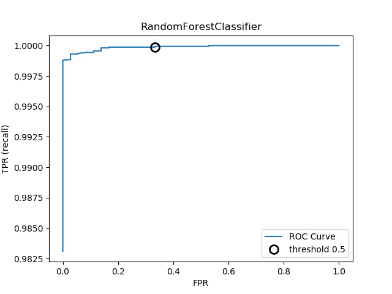
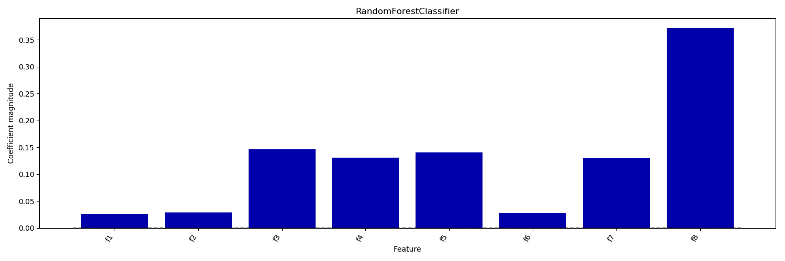

Predicting defective products from key process variables
==========================

This project aims at building an accurate machine learning model to predict whether a product is defective or not, given all the available features. Each product consists of 8 features (f1-f8), which are key process variables measurement results collected from the production line. The column “target” contains the final test results of the product. Any product with a “target” measurement value less than 1000 is considered a defective product. Measurements are provided in a “.csv” file. 

The code is written in python. There is 1 routine:
* analysis.py: it performs the full modelling. __It is intended to be used e.g. in an IPython session, not as a script__.
 
Here we report the version of the libraries used:
* Python 3.6.4
* numpy 1.14.0
* sklearn 0.19.1
* matplotlib 2.1.2

# Feature engineering and modelling
For the purpose of this task we need to build machine learning model. While an advantage of ML is that in many cases we can avoid having to create a set of expert-designed rules, that does not mean that prior knowledge of the application should be discarded. That means, we should attempt to identify useful features that are much more informative than the initial representation of the data.  

For the modelling, we start by using a dummy classifier to always predict the majority class (here “not defective”) to see how uninformative scoring can be. 

Next, we use Logistic regression model with l2 regularization and linear SVC in Scikit Learn. Linear models are a class of models that are widely used, making a prediction using a linear function of the input features. One great advantage of them is the interpretability of the results. For example, linear models have coefficients, which can also be used to capture feature importances by considering the absolute values. 

We will consider progressively more complex model, e.g. RandomForest and Gradient Boosting for classification, which might be a bit harder to interpret at first, but could provide better predictions.
Finally, once determined the best models we deal with, we will use a _majority voting classifier_. This algorithm will allow us to combine different classification associated with individual weights for confidence. Our goal is to build a stronger meta-classifier that balances out the individual classifiers weaknesses on a particular dataset. 

# Dataset Preprocessing
Data are stored as a '.csv' file. We read them via _Pandas_ and store them into an feature matrix X and target vector y (1 for not-defective, 0 for defective).  

The dataset is characterized by some missing values, which we dropped via pandas. Next, we split the datasets into a training and test datasets via stratified sampling: the measurements are divided into homogeneous subgroups called strata, and the right number of instances is sampled from each stratum to guarantee that the test set is representative of the overall measurements. This is particularly important since our dataset is highly imbalanced, and we do not want to run the risk of introducing a significant sampling bias. 

For all the models we set the hyperparameters (e.g. regularization parameter etc.) via _stratified k-fold cross-validation_. In stratified cross-validation, we split the data such that the proportions between classes are the same in each fold as they are in the whole dataset. 

For the metrics which measure the distance between the model and the data we used f-score "weighted", where the per-class f-scores are averaged computing the mean of the per-class f-scores, weighted by their support. We shall present also "macro" averaging which computes the unweighted per class f-scores; and "micro" averaging which computes the total number of false positives, false negatives, and true positives over all classes, and then computes precision, recall, and f-score using these counts. All scorer objects follow the convention that higher return values are better than lower return values. 

We then print the output of the confusion_matrix, which is a two-by-two array, where the rows correspond to the true classes and the columns correspond to the predicted classes. Each entry
counts how often a sample that belongs to the class corresponding to the row (here,
“defective” and “not-defective”) was classified as the class corresponding to the column.  

We also plot the _receiver operating characteristics curve_, or ROC curve. Indeed, in order to understand a modeling problem better, it is instructive to look at all possible thresholds, or all possible trade-offs of precision and recalls at once. We plot thresholds for a given classifier, and show the false positive rate (FPR, or recall) against the _true positive rate_ (TPR). For the ROC curve, the ideal curve is close to the top left: you want a classifier that produces a _high recall_ while keeping a _low false positive rate_. The optimal picked threshold depends on the business problem under exam. 

# Dummy classifier
For the DummyClassifier we have f-scoring of 0.99886. Note that Macro average f1 score: 0.49943, which tell us how poorly this classifier performs. 

# Linear models
We tried Logistic Regression and linear SVC model. The regularization parameter C has been tuned via cross-validation. This models are characterized by large false positives, which limits their use. Score metrics, e.g. f1_macro, are not very high and confirm the inability to describe this imbalanced dataset, with a lot of false positives (pos is the non-defective item). For linear SVC, we get Macro average f1 score: 0.81903, while for Logistic Regression is 0.78743 

# Further modelling
We now consider more complex models, namely RandomForestClassifier and GradientBoostingClassifier.  For the former we obtained Macro average f1 score: 0.93269 and for the latter Macro average f1 score: 0.93063, better than linear models.  For Random Forest, we present the ROC curve below (the big circle corresponds to a threshold of 0.5). 

While it is not easy to interpret the coefficients learned by the tree-based models, it is interesting to point out that they provide a _feature_importances_ attribute, which directly encodes the importance of each feature. Linear models have coefficients, which can also be used to capture feature importances by considering the absolute values. The results from _feature_importances_ are presented in the below fig. 

Finally, for a VotingClassifier we get Macro average f1 score: 0.94105 which is the best score achieved.

